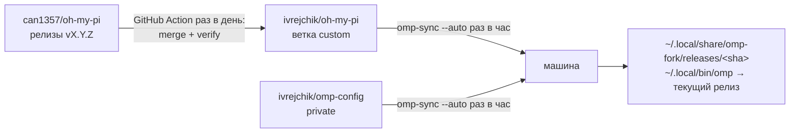

# oh-my-pi: личный форк

Форк [can1357/oh-my-pi](https://github.com/can1357/oh-my-pi) с моими доработками.
Ветка по умолчанию — `custom`: это последний релиз апстрима плюс доработки сверху.
Всё обновляется само: новые релизы апстрима раз в день вливаются в `custom`, а каждая машина раз в час подтягивает `custom` и свои настройки.

Оригинальный README апстрима лежит в корне: [README.md](https://github.com/ivrejchik/oh-my-pi/blob/custom/README.md).
GitHub показывает этот файл (`.github/README.md`) вместо него, а корневой README не тронут, чтобы не конфликтовать при слиянии.

## Что добавлено поверх апстрима

| Доработка | Как включить | Документация |
| --- | --- | --- |
| Бэкенд памяти **claude-mem**: работает с воркером плагина claude-mem напрямую по HTTP (стартовый контекст, наблюдения по результатам инструментов, саммари ходов, `recall`/`retain`/`reflect`) | `memory.backend: claude-mem`, тонкая настройка в `claudeMem.*` | [docs/claude-mem-memory-backend.md](https://github.com/ivrejchik/oh-my-pi/blob/custom/docs/claude-mem-memory-backend.md) |
| Веб-поиск **Keenable** | `web/keenable` в `modelRoles.web`; ключ через `/login keenable` или `KEENABLE_API_KEY`; при явном выборе без ключа работает публичный эндпоинт | [docs/tools/web_search.md](https://github.com/ivrejchik/oh-my-pi/blob/custom/docs/tools/web_search.md) |
| Встроенный агент **architecture-deep-researcher**: исследование архитектурных решений с источниками | доступен в `task` из любой директории | [prompt](https://github.com/ivrejchik/oh-my-pi/blob/custom/packages/coding-agent/src/prompts/agents/architecture-deep-researcher.md) |
| Инструменты форка: автослияние апстрима, релизы и автообновление на машинах | см. ниже | [scripts/fork](https://github.com/ivrejchik/oh-my-pi/tree/custom/scripts/fork) |

## Как всё устроено



Две репы:

| Репа | Доступ | Что внутри |
| --- | --- | --- |
| `ivrejchik/oh-my-pi` (эта) | публичная | Код omp. На машине клонируется в `~/work/personal/oh-my-pi`. |
| `ivrejchik/omp-config` | приватная | Настройки (`home/` → `~/.omp/agent/`), скрипты `omp-sync` и `bootstrap.sh`. |

Ключи и OAuth-токены (`~/.omp/agent/agent.db`) в git не попадают: на каждой машине нужно один раз сделать `/login`.

### Релизы: почему omp не запускается прямо из чекаута

Сессии omp живут днями. Работающая сессия подгружает часть модулей по требованию и перезапускает свои воркеры из тех же файлов. Если обновить файлы под ней, она окажется на смеси старого и нового кода.

Поэтому каждый закоммиченный HEAD устанавливается как отдельный релиз: копия кода на этом коммите (`git worktree`) в `~/.local/share/omp-fork/releases/<sha>` со своими зависимостями и нативом. `~/.local/bin/omp` — маленький скрипт, который запускает текущий релиз. При обновлении меняется только он:

- новые сессии стартуют на новой версии;
- открытые сессии продолжают работать на своём релизе;
- релиз удаляется, когда из него больше не запущен ни один процесс.

Натив подключается жёсткой ссылкой, а зависимости bun на macOS клонирует из кеша, поэтому каждый релиз реально занимает около 200 МБ.

## Новая машина

```bash
curl -fsSL https://bun.sh/install | bash          # если нет bun
gh auth login                                     # нужен доступ к приватной omp-config
gh repo clone ivrejchik/omp-config ~/work/personal/omp-config
~/work/personal/omp-config/bootstrap.sh
omp                                               # затем /login для каждого провайдера
```

`bootstrap.sh`:

1. клонирует этот форк рядом с omp-config (путь можно задать через `OMP_FORK_DIR`);
2. подключает git-хуки в обеих репах и ставит `omp-sync` в `~/.local/bin`;
3. запускает первый синк, который ставит текущий релиз;
4. включает автосинк раз в час и при входе в систему: launchd на macOS, systemd user timer на Linux (Linux-ветка ещё не проверялась на живой машине). Пропустить этот шаг: `OMP_SYNC_NO_SCHEDULE=1`.

Если на машине уже был глобальный `omp`, установленный через `bun`, `~/.bun/bin/omp` перенаправляется на `~/.local/bin/omp`. В `PATH` должен быть `~/.local/bin`.

## Автосинк на машине

Раз в час (и при входе в систему) запускается `omp-sync --auto`:

1. Коммитит изменения настроек, сделанные на этой машине (`sync(<host>): settings <дата>`), подтягивает и пушит omp-config.
2. Создаёт симлинки на всё, что лежит в `home/`, внутри `~/.omp/agent/`.
3. Подтягивает `custom` в чекаут форка, только fast-forward. Свои коммиты из чекаута форка автосинк не пушит.
4. Ставит новый HEAD как релиз и переключает на него `omp`.

Если что-то пошло не так, автосинк ничего не ломает:

- **Конфликт** при слиянии сразу откатывается, чтобы в живом `config.yml` и в коде никогда не оставались маркеры конфликта.
- **Мерж, начатый руками**, автосинк не трогает: видит его и пропускает шаг.
- **Нет сети** — тихо пропускает и пробует через час.

О новой версии и о проблемах приходит уведомление macOS (о каждой проблеме один раз).

| Что | Как |
| --- | --- |
| Синкнуть прямо сейчас | `omp-sync` (интерактивно; ещё и пушит локальные коммиты форка) или `launchctl kickstart -k gui/$(id -u)/omp-config.sync` |
| Лог | `~/.local/state/omp-sync/omp-sync.log` |
| Выключить | macOS: `launchctl bootout gui/$(id -u)/omp-config.sync`; Linux: `systemctl --user disable --now omp-sync.timer` |
| Включить снова | `~/work/personal/omp-config/bootstrap.sh` |

Правила:

- **Не запускай `omp update`.** Он ставит стоковый omp из npm. Проверка обновлений при старте отключена (`startup.checkUpdate: false`).
- **Незакоммиченные правки в чекауте форка в релиз не попадают.** Проверить их можно так: `bun packages/coding-agent/src/cli.ts` внутри чекаута. Или закоммить и запусти `scripts/fork/install.sh`.

## Автообновление с апстрима

Воркфлоу [`fork-upstream-sync`](https://github.com/ivrejchik/oh-my-pi/blob/custom/.github/workflows/fork-upstream-sync.yml) запускается каждый день в 05:17 UTC. Запустить вручную:

```bash
gh workflow run fork-upstream-sync.yml --repo ivrejchik/oh-my-pi --ref custom              # последний релиз
gh workflow run fork-upstream-sync.yml --repo ivrejchik/oh-my-pi --ref custom -f version=18.9.0
```

Что он делает:

1. Берёт последнюю версию `@oh-my-pi/pi-coding-agent` из npm. Релиз вливается только если его натив уже опубликован в npm.
2. `scripts/fork/merge-upstream.sh` делает `git merge vX.Y.Z` в `custom`. Это merge, а не rebase: ветка никогда не перезаписывается через force-push, поэтому машинам достаточно fast-forward.
3. Если слилось без конфликтов: `install.sh --no-launcher` + `verify.sh`, затем push в `custom` и тега `vX.Y.Z`. В течение часа машины подхватят новую версию сами.
4. Если есть конфликт или проверка упала, в форк ничего не пушится, а заводится issue «Upstream vX.Y.Z: merge conflicts» или «… failed verification». На один релиз создаётся одна issue.

Нужен секрет `FORK_SYNC_TOKEN` — токен со скоупами `repo` и `workflow`. Стандартный `GITHUB_TOKEN` не может пушить мерж, который меняет `.github/workflows`. Обновить:

```bash
gh auth token | gh secret set FORK_SYNC_TOKEN --repo ivrejchik/oh-my-pi
```

Апстримные воркфлоу (`CI`, `OMP Nix`, `Warm bun store cache`) в форке отключены. Если после слияния апстрим добавил новый воркфлоу, его тоже нужно отключить: `gh workflow disable "<name>" --repo ivrejchik/oh-my-pi`.

## Если автослияние упало с конфликтом

omp запускается из релизов, а автосинк не трогает мерж, начатый руками. Поэтому разрешать конфликт можно прямо в чекауте форка:

```bash
cd ~/work/personal/oh-my-pi
git pull
scripts/fork/merge-upstream.sh X.Y.Z        # exit 2 = есть конфликты, мерж остаётся открытым
# разрешить конфликты → git add → git commit
scripts/fork/install.sh --no-launcher       # зависимости в чекауте для проверки
scripts/fork/verify.sh
git push origin custom vX.Y.Z
scripts/fork/install.sh                     # сразу перейти на новый релиз (иначе автосинк сделает это сам)
gh issue close <N> --repo ivrejchik/oh-my-pi
```

На что обратить внимание:

- **Генерируемые файлы каталога:** `packages/catalog/src/models.json` нужно взять у апстрима и заново добавить строку `web.keenable` (это копия строки `web.exa` с другими `id` и `name`). `rules.json` пересобирается командой `bun run gen:compat` в `packages/catalog`.
- **CHANGELOG:** взять версию апстрима и вернуть записи форка в раздел `[Unreleased]`.
- Где живёт код форка, чтобы было проще разбирать конфликты:

| Доработка | Файлы |
| --- | --- |
| claude-mem: ядро | `packages/coding-agent/src/claude-mem/**`; настройки в `claude-mem/settings.ts`, зарегистрированы в `config/all-settings.ts` |
| claude-mem: выбор бэкенда | `memory-backend/{settings,resolve,types,index}.ts`, условие `claudeMemActive` в `config/settings-ui.ts`, группа `Claude-mem` в `packages/tui/src/overlays/settings-defs.ts` |
| claude-mem: инструменты | `tools/{memory-recall,memory-retain,memory-reflect,memory-edit,learn,index}.ts`, `prompts/tools/memory-edit.md`, `internal-urls/memory-protocol.ts` |
| claude-mem: авторизация ходов (через IRC и для сабагентов) | `session/{agent-session,irc-bridge,session-memory}.ts`, `irc/bus.ts`, `task/{index,executor,structured-subagent,workpool}.ts`, `eval/agent-bridge.ts`, `vibe/runtime.ts`, `sdk.ts` |
| Keenable | `web/search/providers/keenable.ts`, `web/search/provider.ts`, `packages/tui/src/tools/web-search-types.ts`, `priority.json` (цепочка `web`, сразу после Exa), `packages/catalog/src/compat/rules/{providers/web.kdl,auth/keenable.kdl,auth/_order.kdl}`, `compat/auth-ids.ts`, `cli/help-extra.ts` |
| Встроенный агент | `prompts/agents/architecture-deep-researcher.md`, `task/agents.ts` |

Пути без префикса — относительно `packages/coding-agent/src/`.

## Скрипты форка

| Скрипт | Что делает |
| --- | --- |
| `scripts/fork/merge-upstream.sh [X.Y.Z]` | Вливает релиз апстрима (по умолчанию последний из npm). Коды выхода: `0` — слито или уже есть, `1` — ошибка, `2` — конфликт. |
| `scripts/fork/install.sh` | Ставит закоммиченный HEAD как релиз (зависимости, натив из npm или жёсткой ссылкой из соседнего релиза), переключает `~/.local/bin/omp` и удаляет неиспользуемые релизы. Если HEAD уже установлен, отрабатывает почти мгновенно. Папку релизов можно задать через `OMP_RELEASES_DIR`. |
| `scripts/fork/install.sh --no-launcher` | Готовит текущий чекаут на месте (зависимости + натив), без релиза и лаунчера. Нужен для CI, `verify.sh` и разработки. |
| `scripts/fork/verify.sh` | Проверка типов в `coding-agent`, все тесты, изменённые форком относительно ближайшего тега `v*`, проверка, что встроенные агенты разбираются. |
| `scripts/fork/hooks/post-merge` | После ручного `git pull` в чекауте вызывает `install.sh`. Подключается через `git config core.hooksPath scripts/fork/hooks` (это делает `bootstrap.sh`). Ничего не делает внутри `omp-sync`, который сам вызывает `install.sh`, и в worktree релизов. |

## Своя доработка

1. Закоммить в `custom` и запушь. Другие машины подхватят её в течение часа. На этой машине `git push` + `scripts/fork/install.sh` или просто `omp-sync`.
2. Чтобы меньше конфликтовать с апстримом, клади код в отдельные файлы, а в апстримных файлах оставляй минимальные точки подключения.
3. Тесты клади в `packages/*/test/`: `verify.sh` и CI сами найдут и прогонят их.
4. Новые настройки: свой файл `<domain>/settings.ts` с `register({ id, ... })`, плюс строка в `config/all-settings.ts`. Читать через `cfgX.get(settings)`.
5. Новый встроенный агент: markdown с frontmatter (`name`, `description`) в `src/prompts/agents/`, импорт и запись в `EMBEDDED_AGENT_DEFS` в `src/task/agents.ts`. Встроенные агенты разбираются в строгом режиме: одна ошибка во frontmatter ломает поиск всех агентов. `verify.sh` это ловит.

## Настройки (omp-config)

- Каждый файл или папка из `home/` становится симлинком в `~/.omp/agent/`. omp пишет изменения прямо через симлинк, поэтому всё, что ты меняешь через `/settings`, `/model` или `omp config set`, попадает в репу и уходит на GitHub ближайшим синком.
- Чтобы синкать что-то ещё (`agents/`, `skills/`, `rules/`, `AGENTS.md`, `models.yml`), перенеси это в `home/` и запусти `omp-sync`.
- Не синкаются: `agent.db` (ключи), сессии, история, кеши.
