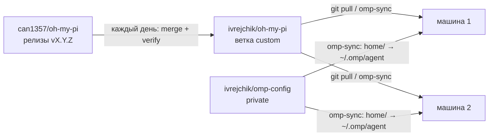

# oh-my-pi: личный форк

Форк [can1357/oh-my-pi](https://github.com/can1357/oh-my-pi) с моими доработками.
Ветка по умолчанию — `custom`: это последний релиз апстрима плюс доработки сверху.
Новые релизы апстрима вливаются в неё автоматически, поэтому на любой машине достаточно `git pull`.

Оригинальный README апстрима лежит в корне: [README.md](https://github.com/ivrejchik/oh-my-pi/blob/custom/README.md).
GitHub показывает этот файл (`.github/README.md`) вместо него, а корневой README не тронут, чтобы не конфликтовать при слиянии.

## Что добавлено поверх апстрима

| Доработка | Как включить | Документация |
| --- | --- | --- |
| Бэкенд памяти **claude-mem**: работает с воркером плагина claude-mem напрямую по HTTP (стартовый контекст, наблюдения по результатам инструментов, саммари ходов, `recall`/`retain`/`reflect`) | `memory.backend: claude-mem`, тонкая настройка в `claudeMem.*` | [docs/claude-mem-memory-backend.md](https://github.com/ivrejchik/oh-my-pi/blob/custom/docs/claude-mem-memory-backend.md) |
| Веб-поиск **Keenable** | `web/keenable` в `modelRoles.web`; ключ через `/login keenable` или `KEENABLE_API_KEY`; при явном выборе без ключа работает публичный эндпоинт | [docs/tools/web_search.md](https://github.com/ivrejchik/oh-my-pi/blob/custom/docs/tools/web_search.md) |
| Встроенный агент **architecture-deep-researcher**: исследование архитектурных решений с источниками | доступен в `task` из любой директории | [prompt](https://github.com/ivrejchik/oh-my-pi/blob/custom/packages/coding-agent/src/prompts/agents/architecture-deep-researcher.md) |
| Инструменты форка: автослияние апстрима, установка из исходников, проверка | см. ниже | [scripts/fork](https://github.com/ivrejchik/oh-my-pi/tree/custom/scripts/fork) |

## Как всё устроено



Две репы:

| Репа | Доступ | Что внутри |
| --- | --- | --- |
| `ivrejchik/oh-my-pi` (эта) | публичная | Код omp. На машине клонируется в `~/work/personal/oh-my-pi`, `omp` запускается прямо из исходников. |
| `ivrejchik/omp-config` | приватная | Настройки (`home/` → `~/.omp/agent/`), скрипты `omp-sync` и `bootstrap.sh`. |

Ключи и OAuth-токены (`~/.omp/agent/agent.db`) в git не попадают: на каждой машине нужно один раз сделать `/login`.

## Новая машина

```bash
curl -fsSL https://bun.sh/install | bash          # если нет bun
gh auth login                                     # нужен доступ к приватной omp-config
gh repo clone ivrejchik/omp-config ~/work/personal/omp-config
~/work/personal/omp-config/bootstrap.sh
omp                                               # затем /login для каждого провайдера
```

`bootstrap.sh` клонирует этот форк рядом с omp-config (путь можно задать через `OMP_FORK_DIR`), подключает git-хуки в обеих репах, ставит `omp-sync` в `~/.local/bin` и запускает первый синк.

После этого `omp` указывает на исходники: `~/.local/bin/omp` → `packages/coding-agent/src/cli.ts`. Если на машине уже был глобальный `omp`, установленный через `bun`, `~/.bun/bin/omp` перенаправляется туда же. В `PATH` должен быть `~/.local/bin`.

## Каждый день

**`omp-sync`** — одна команда, чтобы привести машину в актуальное состояние:

1. Коммитит изменения настроек, сделанные на этой машине (`sync(<host>): settings <дата>`), подтягивает и пушит omp-config.
2. Создаёт симлинки на всё, что лежит в `home/`, внутри `~/.omp/agent/`. Если там уже был обычный файл, он сохраняется как `*.pre-omp-config-<время>`.
3. Если форк на ветке `custom` и без незакоммиченных правок, подтягивает его и пушит локальные коммиты. Иначе выводит предупреждение и пропускает этот шаг.
4. Запускает `scripts/fork/install.sh`: зависимости, натив под нужную версию, лаунчер.

Обычный `git pull` в любой из двух реп тоже всё переустанавливает через хук `post-merge`. Но изменённые настройки коммитит только `omp-sync`.

Правила:

- **Не запускай `omp update`.** Он ставит стоковый omp из npm. Обновления приносит CI форка, а проверка обновлений при старте отключена (`startup.checkUpdate: false`).
- Уже открытые сессии omp продолжают работать на старом коде. Новая версия подхватится после перезапуска.

## Автообновление с апстрима

Воркфлоу [`fork-upstream-sync`](https://github.com/ivrejchik/oh-my-pi/blob/custom/.github/workflows/fork-upstream-sync.yml) запускается каждый день в 05:17 UTC и вручную:

```bash
gh workflow run fork-upstream-sync.yml --repo ivrejchik/oh-my-pi --ref custom              # последний релиз
gh workflow run fork-upstream-sync.yml --repo ivrejchik/oh-my-pi --ref custom -f version=18.9.0
```

Что он делает:

1. Берёт последнюю версию `@oh-my-pi/pi-coding-agent` из npm. Релиз вливается только если его натив уже опубликован в npm.
2. `scripts/fork/merge-upstream.sh` делает `git merge vX.Y.Z` в `custom`. Это merge, а не rebase: ветка никогда не перезаписывается через force-push.
3. Если слилось без конфликтов: `install.sh --no-launcher` + `verify.sh`, затем push в `custom` и тега `vX.Y.Z`.
4. Если есть конфликт или проверка упала, в форк ничего не пушится, а заводится issue «Upstream vX.Y.Z: merge conflicts» или «… failed verification». На один релиз создаётся одна issue, повторные запуски дублей не плодят.

Нужен секрет `FORK_SYNC_TOKEN` — токен со скоупами `repo` и `workflow`. Стандартный `GITHUB_TOKEN` не может пушить мерж, который меняет `.github/workflows`. Обновить:

```bash
gh auth token | gh secret set FORK_SYNC_TOKEN --repo ivrejchik/oh-my-pi
```

Апстримные воркфлоу (`CI`, `OMP Nix`, `Warm bun store cache`) в форке отключены. Если после слияния апстрим добавил новый воркфлоу, его тоже нужно отключить: `gh workflow disable "<name>" --repo ivrejchik/oh-my-pi`.

## Если автослияние упало с конфликтом

Разрешать лучше в отдельном worktree, чтобы рабочий `omp` не сломался посреди мержа:

```bash
cd ~/work/personal/oh-my-pi
git fetch origin
git worktree add -b merge/vX.Y.Z ../oh-my-pi-merge origin/custom
cd ../oh-my-pi-merge
scripts/fork/merge-upstream.sh X.Y.Z        # exit 2 = есть конфликты, мерж остаётся открытым
# разрешить конфликты → git add → git commit
scripts/fork/install.sh --no-launcher
scripts/fork/verify.sh
git push origin HEAD:custom && git push origin vX.Y.Z
cd ../oh-my-pi && git worktree remove ../oh-my-pi-merge && git branch -D merge/vX.Y.Z
gh issue close <N> --repo ivrejchik/oh-my-pi
git pull                                     # хук переустановит omp
```

На что обратить внимание:

- **Не запускай `git config` внутри worktree:** изменения пишутся в общий конфиг репы и ломают хуки основного чекаута (например, `core.hooksPath`).
- **Генерируемые файлы каталога:** `packages/catalog/src/models.json` нужно взять у апстрима и заново добавить строку `web.keenable` (это копия строки `web.exa` с другими `id` и `name`). `rules.json` пересобирается командой `bun run gen:compat` в `packages/catalog`.
- **CHANGELOG:** взять версию апстрима и вернуть записи форка в раздел `[Unreleased]`.
- Где живёт код форка, чтобы было проще разбирать конфликты:

| Доработка | Файлы |
| --- | --- |
| claude-mem: ядро | `packages/coding-agent/src/claude-mem/**`; настройки в `claude-mem/settings.ts`, зарегистрированы в `config/all-settings.ts` |
| claude-mem: выбор бэкенда | `memory-backend/{settings,resolve,types,index}.ts`, условие `claudeMemActive` в `config/settings-ui.ts`, группа `Claude-mem` в `packages/tui/src/overlays/settings-defs.ts` |
| claude-mem: инструменты | `tools/{memory-recall,memory-retain,memory-reflect,memory-edit,learn,index}.ts`, `prompts/tools/memory-edit.md`, `internal-urls/memory-protocol.ts` |
| claude-mem: авторизация ходов (через IRC и для сабагентов) | `session/{agent-session,irc-bridge,session-memory}.ts`, `irc/bus.ts`, `task/{index,executor,structured-subagent,workpool}.ts`, `eval/agent-bridge.ts`, `vibe/runtime.ts`, `sdk.ts` |
| Keenable | `web/search/providers/keenable.ts`, `web/search/provider.ts`, `packages/tui/src/tools/web-search-types.ts`, `priority.json` (цепочка `web`, сразу после Exa), `packages/catalog/src/compat/rules/{providers/web.kdl,auth/keenable.kdl,auth/_order.kdl}`, `compat/auth-ids.ts`, `cli/help-extra.ts` |
| Встроенный агент | `prompts/agents/architecture-deep-researcher.md`, `task/agents.ts` |

Пути без префикса — относительно `packages/coding-agent/src/`.

## Скрипты форка

| Скрипт | Что делает |
| --- | --- |
| `scripts/fork/merge-upstream.sh [X.Y.Z]` | Вливает релиз апстрима (по умолчанию последний из npm). Коды выхода: `0` — слито или уже есть, `1` — ошибка, `2` — конфликт. |
| `scripts/fork/install.sh [--no-launcher]` | `bun install --frozen-lockfile`, скачивает готовый натив из npm, если версия не совпадает, ставит лаунчер `omp`. |
| `scripts/fork/verify.sh` | Проверка типов в `coding-agent`, все тесты, изменённые форком относительно ближайшего тега `v*`, проверка, что встроенные агенты разбираются. |
| `scripts/fork/hooks/post-merge` | Вызывает `install.sh` после `git pull`. Подключается через `git config core.hooksPath scripts/fork/hooks` (это делает `bootstrap.sh`). В отдельных worktree ничего не делает, чтобы лаунчер `omp` всегда указывал на основной чекаут. |

## Своя доработка

1. Закоммить в `custom` и запушь. Другие машины получат её через `omp-sync` или `git pull`.
2. Чтобы меньше конфликтовать с апстримом, клади код в отдельные файлы, а в апстримных файлах оставляй минимальные точки подключения.
3. Тесты клади в `packages/*/test/`: `verify.sh` и CI сами найдут и прогонят их.
4. Новые настройки: свой файл `<domain>/settings.ts` с `register({ id, ... })`, плюс строка в `config/all-settings.ts`. Читать через `cfgX.get(settings)`.
5. Новый встроенный агент: markdown с frontmatter (`name`, `description`) в `src/prompts/agents/`, импорт и запись в `EMBEDDED_AGENT_DEFS` в `src/task/agents.ts`. Встроенные агенты разбираются в строгом режиме: одна ошибка во frontmatter ломает поиск всех агентов. `verify.sh` это ловит.

## Настройки (omp-config)

- Каждый файл или папка из `home/` становится симлинком в `~/.omp/agent/`. omp пишет изменения прямо через симлинк, поэтому всё, что ты меняешь через `/settings`, `/model` или `omp config set`, попадает в репу и коммитится следующим `omp-sync`.
- Чтобы синкать что-то ещё (`agents/`, `skills/`, `rules/`, `AGENTS.md`, `models.yml`), перенеси это в `home/` и запусти `omp-sync`.
- Не синкаются: `agent.db` (ключи), сессии, история, кеши.
